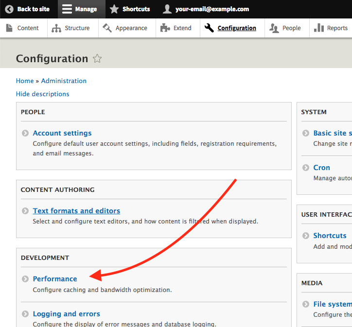
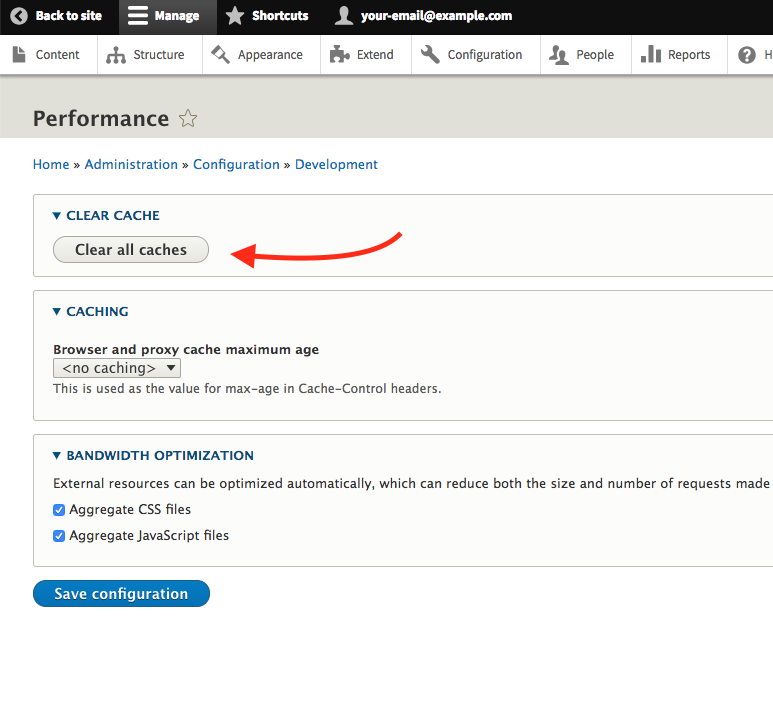

# Clear Drupal's Cache

Drupal's configuraton system and hook system is not "lightweight". In order to keep the CMS running (somewhat) quickly, Drupal makes use of heavy caching which means you need to pretty frequently clear it.

#### 1.) Go to the Configuration > Performance
---

#### 2.) Clear the cache
---

