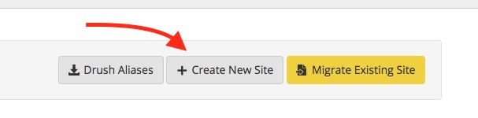
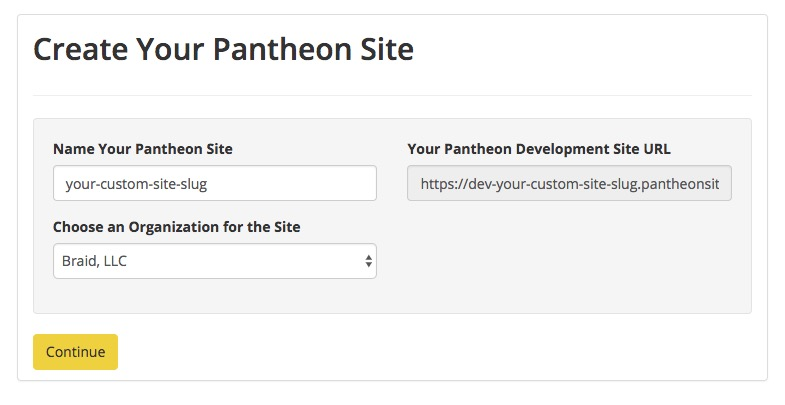
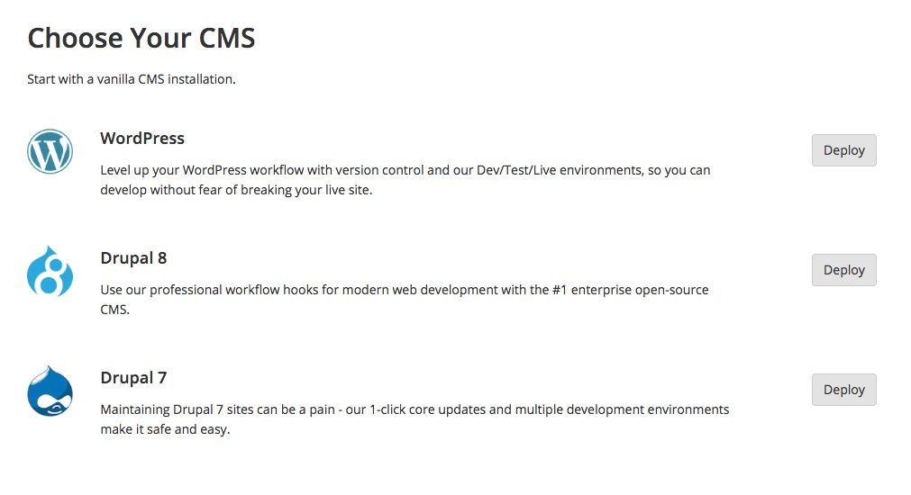

# Pantheon Drupal Project Setup

#### 1.) Create a new site.
---

#### 2.) Add site details and click "continue". This process will take a few minuets.
---

#### 3.) Once the site creation is complete, choose **Drupal** from the menu.
---

#### 4.) Install Drupal 8
---
_Note: We do not have instructions for Drupal 7 in this session_

#### 5.) Follow the standard Drupal install steps.
---

At this point your answers to these questions are not critical because we will ulitmately replace this database.

#### 6.) Enable the Update Manager.
---

Install the [REST UI Module](https://www.drupal.org/project/restui) by copying it's URL (https://www.drupal.org/project/restui) into the install module page.

#### 7.) Install the REST UI.
---

Install the [REST UI Module](https://www.drupal.org/project/restui) by copying it's URL (https://ftp.drupal.org/files/projects/restui-8.x-1.15.tar.gz) into the install module page.

*Note: If you don't see the "install new module" button" you'll need to [clear Drupal's cache.](drupal-cache.md)*

#### 8.) Re-Open the Pantheon dashboard for your site and navigate to the database import screen. Download the following database export, and then upload it via the "file" method.

Download the following database file for import: [http://brd.bz/69d10d65](http://brd.bz/69d10d65)

---

#### 9.) Navigate to your website URL and you should now see staff content.

Your new login credentials for the Drupal install will now be username `admin` password `headless-edui`.

---

#### 10.) Access the api endpoint.

In Drupal, API endpoints are accessed by appending the query string `_format=` with the appropriate data format (`json` in our case). So to access a directory of all the staff navigate to (be sure to use your site's url):

http://dev-your-site-name.pantheonsite.io/staff?_format=json

---

