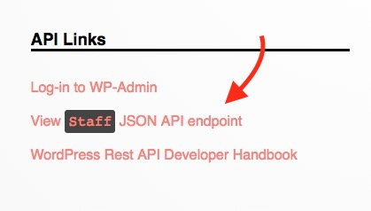

# Pantheon WordPress Project Setup

#### 1.) Create a new site.
---

#### 2.) Add site details and click "continue". This process will take a few minuets.
---

#### 3.) Once the site creation is complete, choose **WordPress** from the menu.
-

#### 4.) Install WordPress
---

#### 5.) Follow the standard WordPress install steps. The data you provide here does not matter (but you will need it to log in for the first time). This data will ultimately be replaced by a database import in a later step.
---

#### 6.) Download the provided headless WordPress theme and install it using the "Upload Theme" option. Once it is uploaded, activate the theme.

Download the theme here: http://brd.bz/5d52675e

---

#### 7.) Once the theme is activated, there will be a prompt asking you to install required supporting plugins for this project. choose "Begin installing plugins", 
---

#### 8.) Re-Open the Pantheon dashboard for your site and navigate to the database import screen. Download the following database export, and then upload it via the "file" method.

Download the following database file for import: http://brd.bz/fc21dad4

---

#### 9.) Navigate to your website URL and you should now see the "headless" theme has been activated

Your new login credentials for the WordPress install will now be username `admin` password `headless-edui`.

---

#### 10.) Follow the link to the `Staff` API endpoint, and you should see the data that we will be working with for our application.
---

